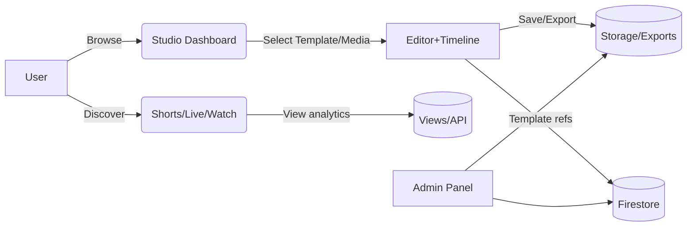

## Project Intake Pack

### Executive Summary
Existing app (~60% complete) built with React (Vite), Tailwind, Fabric.js editor, Firebase (Auth/Firestore/Storage), serverless functions, and media integrations. The Studio (editor) is ~10% of the broader product, which also includes content discovery (Shorts, Live, Watch, Search), admin/content ops, analytics, and integrations.

### Global Architecture Overview
- Frontend (Vite + React + Tailwind)
  - App shell: `src/App.tsx`, routing pages under `src/pages/`
  - Global state/contexts: theme, language, editor store
  - Components library: `src/components/**` (Studio editor, timeline, discovery components)
- Editor Subsystem
  - Fabric.js canvas editor: `src/components/ViewsBoostCanvaEditor.tsx`
  - Media renderer: `src/utils/canvasMedia.ts` (offscreen-canvas video pipeline)
  - Timeline engine: `src/services/TimelineEngine.ts` + `src/components/ProfessionalTimeline.tsx`
- Templates System
  - Loader: `src/lib/useTemplates.ts`, Firestore-only mode + local manifests
  - Admin & category mgmt: `src/components/TemplateCategoryManager.tsx`
- Content Discovery & Playback
  - Pages: `src/pages/Shorts.tsx`, `src/pages/Live.tsx`, `src/pages/VideoWatchPage.tsx`, `src/pages/SearchHistoryPage.tsx`, `src/pages/WatchHistoryPage.tsx`
  - Caching/YouTube utilities: `src/lib/youtube*` and `src/lib/youtube-caching/*`
- Backend & Integrations
  - Firebase: `src/lib/firebase.ts`, rules at `/firestore.rules`, indexes at `/firestore.indexes.json`
  - Cloud Functions: `/functions` and `/functions-server/src/index.ts`
  - Media sourcing agent (optional pipeline): `/media-sourcing-agent`
  - App API routes: `app/api/**` (e.g., `app/api/views/route.ts`)
- Tooling
  - Scripts for template generation/migration: `/scripts/**`, `/generated-templates/**`
  - FFmpeg assets for client-side processing: `public/ffmpeg/*`

---

### Feature Status Table
| Area / Feature | Status (Done/Partial/Todo) | Owner/Notes | Blockers |
| --- | --- | --- | --- |
| Auth: Sign up / Login | Partial | `src/lib/auth.ts`; sessions ok | Email verify, password reset, SSO decision |
| Roles & Admin gating | Todo | Needed for Admin Panel and content ops | Auth claims, route guards |
| Studio Dashboard | Partial | Quick Start, Templates, Stock Media grids | Content curation, empty states |
| Editor: Fabric.js | Partial | Image/text tools, video draw via offscreen canvas | Multi-select polish, autosave, snapping defaults |
| Timeline (Video) | Partial | Play/pause/scrub sync; trim; alt-drag duplicate; zoom slider; overview scrub | Full-width thumbs, transitions UI, multi-select/group |
| Audio Track | Todo | Optional, added from sidebar | “Add Audio” flow, waveform from file |
| Export | Partial | PNG/JPG/JSON | MP4/GIF path, server ffmpeg, queue |
| Templates (Firestore) | Partial | `useTemplates.ts` Firestore-only; preview modal | Write ops from Admin, structure finalization |
| Template Admin/Category | Partial | Category manager present | Role gating, bulk ops, logs |
| Content Discovery (Shorts) | Partial | Page exists, data wiring TBD | Feed source, pagination |
| Live / Live Room | Partial | Pages scaffolded | Realtime backend, signaling |
| Video Watch Page | Partial | Player page exists | Analytics, related content |
| Search & History | Partial | Search/Watch history pages exist | Storage model, filters |
| Media Integrations | Partial | Unsplash/Pexels clients; local manifests | API keys, quotas, attribution |
| API Routes | Partial | `app/api/views/route.ts` | Auth, rate limit, errors |
| Analytics & Monitoring | Partial | `src/lib/logger.ts`, `monitoring.ts` | Sentry/Logs hookup |
| Deployment/CI | Todo | Vite config ready | Hosting choice, CI pipeline, env mgmt |
| Accessibility / i18n | Todo | Language context scaffold | Keyboard/focus/RTL |
| Documentation | Partial | Multiple guides present | Unify into runbook & handover |

---

### Broken Areas Log
1) Screen/Flow: Studio → Open Stock Video in Editor
- Expected vs Actual: Selected video appears and plays reliably; previously black frame
- Steps to Reproduce: Studio → Stock Videos → click
- Severity: High
- Suspected cause / related PR: Fixed via offscreen-canvas pipeline in `src/utils/canvasMedia.ts`

2) Screen/Flow: Category filtering for templates
- Expected vs Actual: Correct Firestore templates under each Studio category
- Steps: Change categories; observe console logs in `useTemplates.ts`
- Severity: Med
- Suspected cause: Label mismatch Admin↔App; mapping logic improvements pending

3) Screen/Flow: Quick Start thumbnails
- Expected vs Actual: All thumbs visible; some missing
- Steps: Studio Dashboard → Quick Start
- Severity: Low
- Suspected cause: Asset ref to removed `/react.svg`

4) Screen/Flow: Export MP4/GIF
- Expected vs Actual: Video export available; currently image/JSON only
- Steps: Editor → Export
- Severity: High
- Suspected cause: No server-side render; ffmpeg path unimplemented

5) Screen/Flow: Admin bulk ops
- Expected vs Actual: Mass delete/duplicate
- Steps: Admin → Category Manager
- Severity: Med
- Suspected cause: Firestore writes/roles not finished

---

### UI/UX Handover
- Design source: [Figma link here]
- Asset library: [Brand/Icons link]
- Design vs Build gaps
  - Thumbnails along clip width (timeline)
  - Transition controls (fade/slide/zoom with durations)
  - Loading/empty/error states for grids and previews
  - Sidebar spacing uniformity; consistent 8/12 spacing scale
- Critical user journeys to preserve
  - Choose template or stock media → Editor → Export
  - Search/browse categories → Preview → Open in Editor
  - Upload media → Canvas operations → Save project
- Accessibility / i18n constraints
  - Keyboard operability: canvas tools & timeline controls
  - High-contrast and reduced-motion modes
  - Externalized copy, RTL preparedness

---

### Kickoff Message (Draft)
Context: Existing project ~60% complete. Multi-surface product: Studio editor, discovery surfaces (Shorts/Live/Watch), admin ops, and integrations.
Goal (2–4 weeks): MVP with reliable editor/timeline, searchable templates, and export (image + baseline video), plus admin gating and content flow fixes.
Top 5 issues:
- Template data model and filtering alignment
- Export pipeline (PNG/JPG + MP4 baseline)
- Missing UI states (loading/empty/error)
- Optional Audio track flow
- Admin Panel hardening & role-based access
Repo/Env links: [GitHub], [Staging], [Prod], [Firebase console], [Monitoring]
Figma & Assets: [Design link]
Loom walkthrough: [Video link]

Please start the brownfield work.

---

## One‑Page Runbook
### Prerequisites
- Node LTS, pnpm/npm
- Firebase project (Firestore/Storage/Auth), service account (for scripts)
- API keys: Unsplash/Pexels/YouTube (optional)

### Setup
1. Clone repo; install deps: `npm i`
2. Create `.env.local` with:
   - VITE_FIREBASE_* (apiKey, authDomain, projectId, storageBucket, messagingSenderId, appId)
   - Media API keys as needed
3. (Optional) Place ffmpeg assets at `public/ffmpeg/*` (already included)

### Run (dev)
```
npm run dev
```
Open `http://localhost:5173`.

### Build
```
npm run build && npm run preview
```

### Firebase
- Rules: `/firestore.rules`
- Indexes: `/firestore.indexes.json`
- Functions: `/functions` and `/functions-server/src/index.ts`

### Common Tasks
- Template thumbnails: `scripts/generate-thumbnails.cjs`
- Update aspect ratios: `scripts/update-aspect-ratios.cjs`
- Import templates: `scripts/create-templates-from-videos.cjs`

---

## Tech Map (High‑Level)
### Components
- Studio UI (dashboard + editor + timeline)
- Discovery surfaces (Shorts, Live, Watch, Search/History)
- Admin & Template ops
- API routes & serverless functions
- Firestore/Storage

### Data & Flows (Mermaid)


### Editor/Timeline Internals
- Fabric.js canvas
- Offscreen-canvas video rendering (first frame + continuous frames)
- Timeline engine (PixiJS): playhead, trim, duplicate, zoom, overview scrub
- Video bridge: `window.__viewsboost_video_controls` for play/pause/seek

### Export Strategy (MVP → Next)
- MVP: PNG/JPG; JSON project
- Next: MP4/GIF (client ffmpeg or serverless ffmpeg), render queue, progress UI

---

## Next Steps & Milestones
### Week 1
- Align template categories; fix Quick Start thumbs
- Implement export PNG/JPG polish; loading/empty/error states
### Week 2
- Admin gating (roles); bulk ops; logs
- “Add Audio” flow (sidebar triggers audio track creation)
### Week 3
- Timeline thumbnails; transitions mini-UI; multi-select
### Week 4
- Perf + a11y pass; QA; docs; MVP release

---

## Owner Fields (Fill‑ins)
- Engineering lead:
- PM / Design:
- Firebase project ID:
- Staging/Prod URLs:

---

## Appendices (Pointers)
- Key code: `src/components/ViewsBoostCanvaEditor.tsx`, `src/services/TimelineEngine.ts`, `src/utils/canvasMedia.ts`, `src/lib/useTemplates.ts`
- Pages map: `src/pages/**` (Studio, Shorts, Live, Watch, Admin, Auth)
- Tooling: `/scripts/**`, `/media-sourcing-agent/**`


